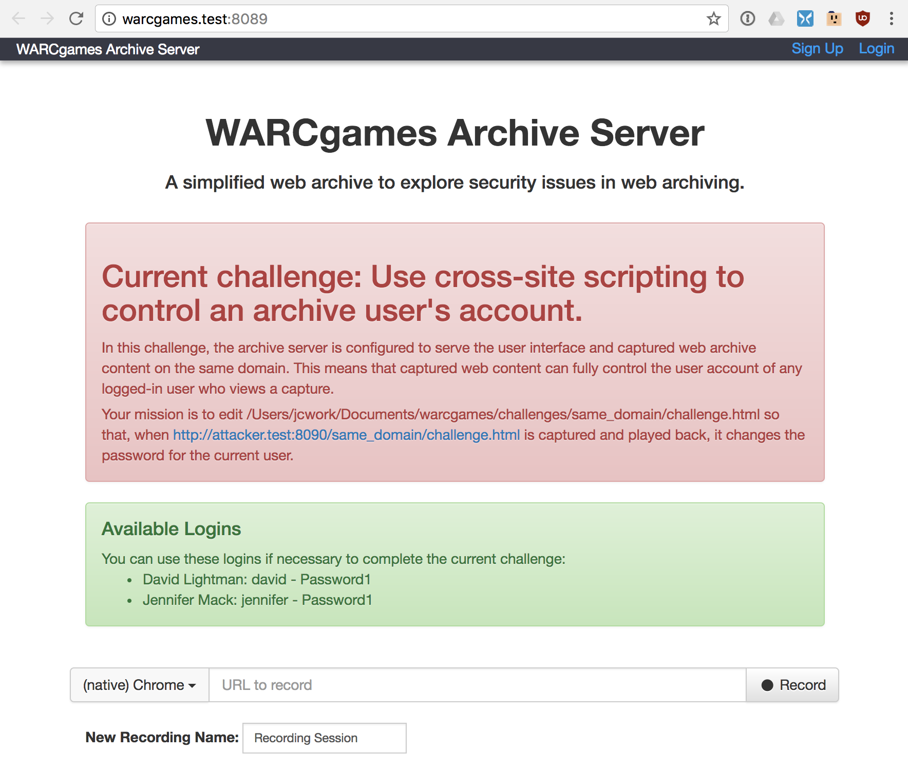
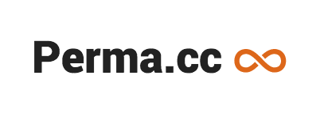

WARCgames
=========

*With High Fidelity Comes Great Responsibility*

As web archiving tools adapt to the Javascript-driven web with headless browser capture, interactive capture, 
and high fidelity playback, they also become more difficult to secure. Weaknesses in web archiving tools themselves can
be exploited to steal user secrets, fake the historical record, or delete valuable record. Once an exploit enters a web
archive, it can harm users or the archive itself with every access.

We (the creators  of [Webrecorder](https://webrecorder.io/) and [Perma.cc](https://perma.cc/)) want to demonstrate these
risks and learn to improve our defenses against them. We want to share what we know and learn from you as well. 
That's why WARCgames exists.

This repository provides you with a local version of Webrecorder that has not been patched to fix known exploits,
and a number of challenges for you learn how they might apply to web archives in general.

WARCgames was first introduced at [IIPC2017](http://netpreserve.org/wac2017/) in London. 
(See [slides](http://labs.rhizome.org/presentations/security.html) for the talk.)



Install and Run
---------------

1) [Install Docker](https://docs.docker.com/installation/)

2) `git clone https://github.com/harvard-lil/warcgames`

3) `cd warcgames`

4) Add the following to /etc/hosts:
```
127.0.0.1   warcgames.test
127.0.0.1   content.warcgames.test
127.0.0.1   warcgames-content.test
127.0.0.1   attacker.test
```
4) `python warcgames.py` to see a list of challenges.

5) `python warcgames.py same_domain` to start the first challenge.

Challenges
----------

WARCgames currently offers the following challenges:

<!-- The following is automatically populated --> 
<!-- CHALLENGES -->
* content_switch: Show different content for archived and live web.
* csrf: Use cross-site request forgery to control an archive user's account.
* port_scan: Discover services running on the archive server.
* same_domain: Use cross-site scripting (XSS) to control an archive user's account.
* same_subdomain: Use top-level cookies to log out the current user.
<!-- END CHALLENGES-->

(This is the output of `python warcgames.py`)

Tips and Hints
--------------

### Faster debugging

Solving challenges often requires you to test the security limits of Javascript run from `challenge.html` inside
the web archive. You can speed up your experimentation by adding something like this to your `challenge.html`:

```
  <form>
    <textarea id="run_js"></textarea>
    <input type="button" onclick="console.log(eval(document.getElementById('run_js').value))" value="eval">
  </form>
```

This lets you quickly try different Javascript techniques and log the results, while making sure you're running in the
correct security context.

Contributing Challenges
-----------------------

Please file [an issue](issues) tagged with "proposed challenge" if you would like WARCgames to support a new challenge.

Even better, send a pull request!

### Challenge format

Each challenge is a subdirectory under `challenges/`. Files:

* `config.py`: Python file that defines:
    * `short_message`: short text description of the challenge.
    * `message`: HTML description of the challenge to embed at https://warcgames.test:8089/
    * `CONTENT_HOST` (optional, default `warcgames-content.test:8089`): host to serve captured content.
    * `include_wombat` (optional, default false): if true, wombat.js will be included in the header of captured pages.
      This should be included only for challenges that require sub-assets to load correctly.
* `challenge.html`: file for user to edit when attempting challenge.
* `sample_answer.html`: sample version of `challenge.html` that correctly completes the challenge.
* `wsgi.py` (optional): custom wsgi file, used to monkeypatch app server.

If you add a challenge, run `python support_files/dev_scripts.py update_files` to update the list in the README.

Security Reporting
------------------

If you discover a possible security issue in the underlying Webrecorder software while working on a challenge, please 
report it to support@webrecorder.io rather than filing an issue on this project.

[](https://webrecorder.io/)
[](https://perma.cc/)