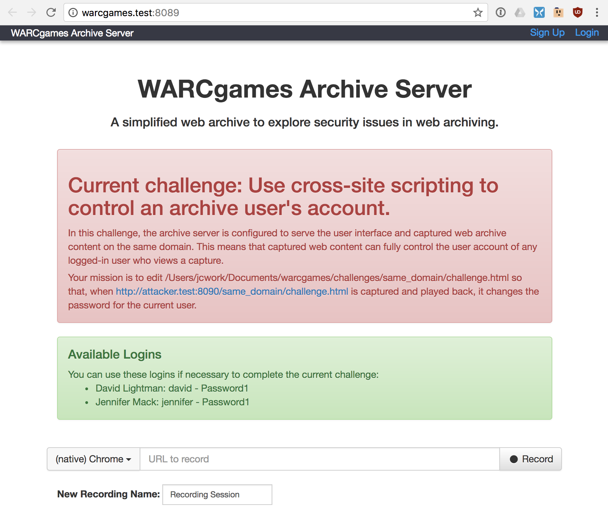

WARCgames
=========

Building secure web archival tools is hard, because web archives have to ingest and play back so much attacker-submitted
content. WARCgames challenges you to attack deliberately-insecure, simplified web archive services running on your local
computer, and thereby learn to create secure ones.

Install and Run
---------------

1) [Install Docker](https://docs.docker.com/installation/)

2) `git clone https://github.com/jcushman/warcgames`

3) `cd warcgames`

4) `cat hosts | sudo tee -a /etc/hosts` (or otherwise arrange for the domains in the `hosts` file to resolve to localhost)

4) `python warcgames.py` to see a list of challenges.

5) `python warcgames.py same_domain` to start the first challenge.